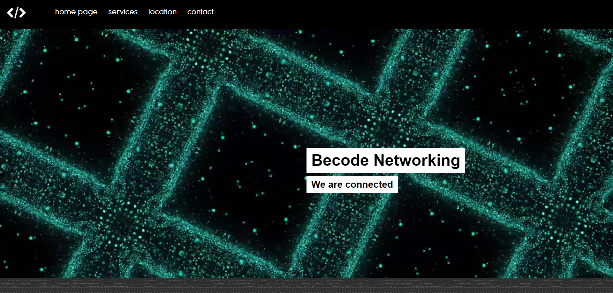
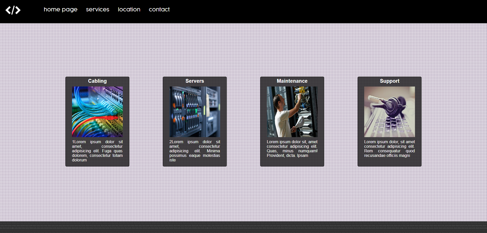
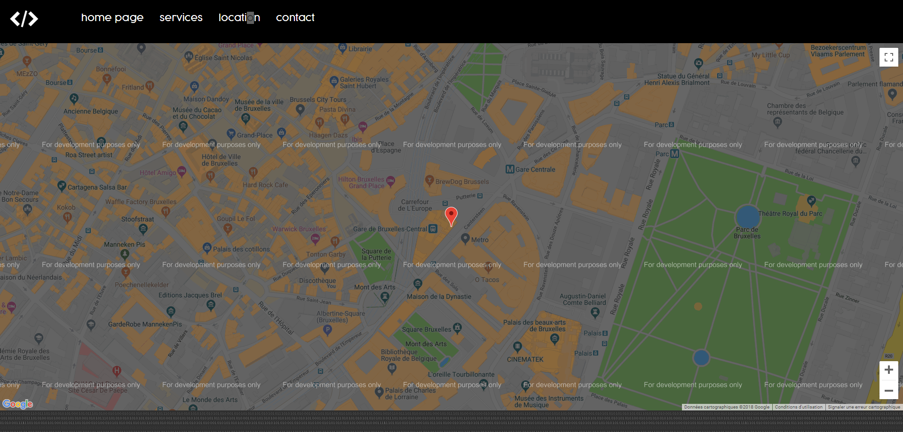
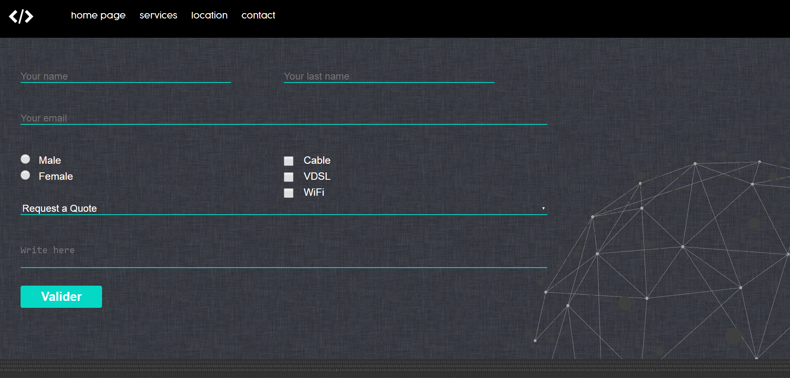

# recap-html-css
Becode Networking
We have created a website for an imaginary company called **"Becode Networking"**, this virtual company is specialized in the installation and maintenance of networks.

## Person(s) involved in the Project.

- Oussama and Dop 

## Scope of the Project.

This is a web development project. The objective is to design a one pager website didived into the following sections using **HTML and CSS**.

## When the code was written.

The code was written Friday the 14 sept. 2018 during an exercise at the _Becode coding academy_. The code has been edited once in order include a *markdown file*.
It was finished on sept 24th. 
 
## Coding journey.

Since writing the code there hasn't been any significant changes in our professional careers. We are currently enrolled as student at the said academy.

## Code preview.

 Below is a link to the code:

[Our Project](https://oussrh.github.io/recap-html-css/)

The code is complete. The final project shall be pitched infront of potential clients. 

## Content

The code consist of basic HTML and CSS using Grid. This code is just a simple web page and does not contain any executable file. It consist the the following sections: 
1. Home
2. Services
3. Location
4. Contact 

We used 3 seperate @media files in the CSS  to make the page responsive to computer browsers, tablets and smartphones.

## Origin

The code was written as part of an assignment in class.

By Dop & Oussama
